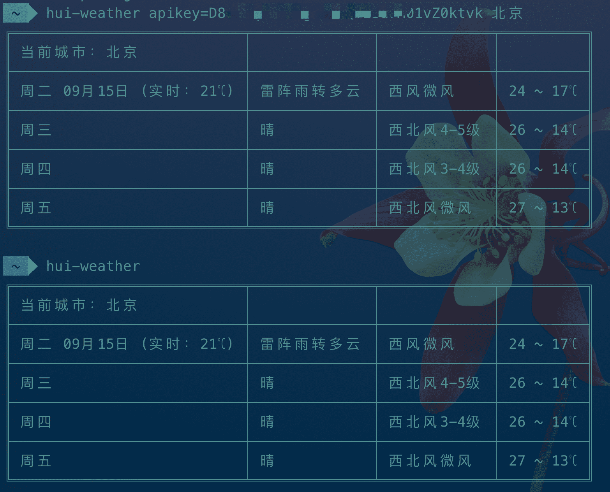

# Hui-weather

node.js 写的小工具，使用百度天气 api 获取天气

## Usages

```sh
npm i hui-weather -g
```

首次使用时配置一下百度的 ak 和城市
```sh
hui-weather apikey=yourAk 北京
```

之后使用时，命令行输入`hui-weather`即可打印天气数据，apikey 和城市再次输入时会覆盖之前

```sh
// 获取天气
hui-weather

// 城市可重新配置
hui-weather 郑州

// ak 可重新配置
hui-weather apikey=newak
```

